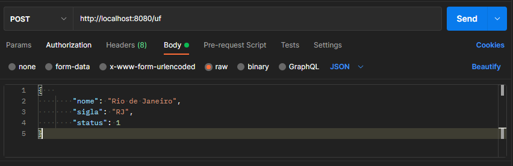
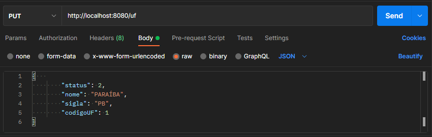
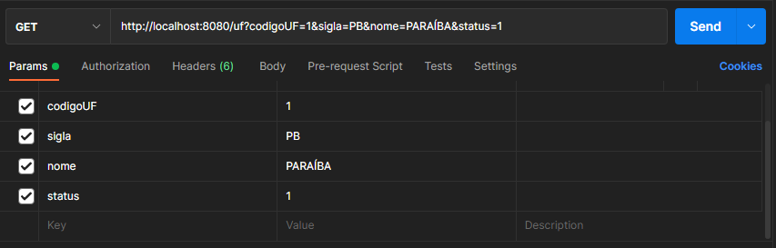
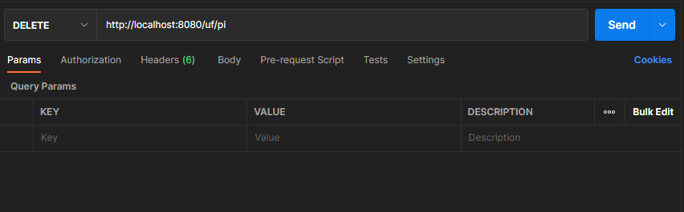

# 💻 DESAFIO FINAL - New Thinkes Program 2022:

Ao longo dessa jornada construiremos uma aplicação back-end de cadastro de endereços. Trabalharemos com cadastro
de UF, MUNICÍPIO, BAIRRO, ENDEREÇO e PESSOA. Iremos permitir o cadastro de vários endereços para uma pessoa.

CONSIDERAÇÕES GERAIS:

Construiremos: UF, MUNICIPIO, BAIRRO, PESSOA

- GET - obrigatório

- POST - obrigatório

- PUT - obrigatório

- DELETE - opcional

- Pode fazer apenas alterando um status de 1 para 2
- Pode fazer deletando um registro, mas neste caso precisa ser com deleção em cascata.

Todas as respostas devem vir com status 200 se deu certo e um status diferente de 200 se algo deu errado.
As mensagens de erro devem vir sempre em português

## 💻 Tecnologias utilizadas:

- JAVA 18
- Oracle Database
- Maven
- Spring
- JPA
- Postman

**Inicie o sistema a partir da clase** 

    @SpringBootApplication
    public class SquadraApplication {

    public static void main(String[] args) {
        SpringApplication.run(SquadraApplication.class, args);
         }
    }

**▶️Utilização**

1 - Cadastrar UF - **POST** ✅️

2 - Atualizar UF - **PUT** ☑️

3 - Buscar UF por criterio - **GET** 🔍

4 - Deletar UF por sigla - **DELETE** ❌

